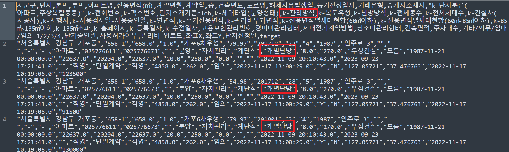
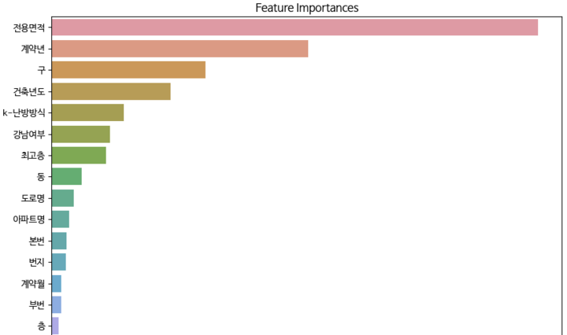

# Title (Please modify the title)
## Team

|  |  |  |  |  |
| :--------------------------------------------------------------: | :--------------------------------------------------------------: | :--------------------------------------------------------------: | :--------------------------------------------------------------: | :--------------------------------------------------------------: |
|            [마서연](https://github.com/UpstageAILab)             |            [권희수](https://github.com/UpstageAILab)             |            [김정우](https://github.com/jw3520)             |            [김윤환](https://github.com/UpstageAILab)             |            [주남정](https://github.com/UpstageAILab)             |
|                            팀장, 담당 역할                             |                            담당 역할                             |                            담당 역할                             |                            담당 역할                             |                            담당 역할                             |

## 0. Overview
### Environment
- _Write Development environment_

### Requirements
- _Write Requirements_

## 1. Competiton Info

### Overview

- _Write competition information_

### Timeline

- ex) January 10, 2024 - Start Date
- ex) February 10, 2024 - Final submission deadline

## 2. Components

### Directory

- _Insert your directory structure_

e.g.
```
├── code
│   ├── jupyter_notebooks
│   │   └── model_train.ipynb
│   └── train.py
├── docs
│   ├── pdf
│   │   └── (Template) [패스트캠퍼스] Upstage AI Lab 1기_그룹 스터디 .pptx
│   └── paper
└── input
    └── data
        ├── eval
        └── train
```


## 3-1. Data descrption

### Dataset overview

- 아파트 실거래가 예측 : 서울시 아파트 실거래가 매매 데이터를 기반으로 아파트 가격을 예측하기 위한 dataset 입니다. 
- 멘토님의 답변이나 강의 및 특강을 들으면서 얻었던 인사이트는 ML에서 좋은 성과를 내려면 EDA라는 기초공사를 얼마만큼 잘 해내야인 것 같았습니다.
- 주어진 train dataset인 train.csv에서 많은 항목의 결측치를 확인했는데 이러한 결측치 중 실거래가에 영향을 미치는 데이터를 보완할 수 있다면, 아파트 실거래가 예측같은 해당 시점의 매매 실거래가를 예측하는 Regression 대회의 평가지표(RMSE)를 올릴 수 있다고 판단했습니다. 
- 기존 아파트 가격과 관련된 연구되었던 자료를 리서치했고 그 중에 ‘난방방식’이 아파트 가격에 영향을 미친다는 자료를 확인했습니다. train.csv의 ‘k_난방방식’ 항목의 결측치가 상당부분 존재했으며, 이 데이터의 많은 부분은 서울시 공공주택 아파트 정보 Open API 등으로 데이터가 제공되어 있어 해당 데이터를 가져와 train.csv를 보완하면 된다고 판단했습니다.


### EDA & Data Processing

1. Database 에 train.csv를 import
- Tools : MariaDB 11.5.2, Mysql Workbench 8.0 CE

2. DB에 적재된 train 데이터 중 k_난방방식 항목을 외부 데이터를 가져와 보완

    1. 데이터 import를 편하게 하기 위해서 일부러 컬럼의 데이터 형태를 VARCHAR(255) 생성
        ```
        CREATE TABLE ml.train (
        시군구 VARCHAR(255),
        번지 VARCHAR(255),
        본번 VARCHAR(255),
        부번 VARCHAR(255),
        아파트명 VARCHAR(255),
        전용면적 VARCHAR(255),
        계약년월 VARCHAR(255),
        계약일 VARCHAR(255),
        층 VARCHAR(255),
        건축년도 VARCHAR(255),
        도로명 VARCHAR(255),
        해제사유발생일 VARCHAR(255),
        등기신청일자 VARCHAR(255),
        거래유형 VARCHAR(255),
        중개사소재지 VARCHAR(255),
        k_단지분류 VARCHAR(255),
        k_전화번호 VARCHAR(255),
        k_팩스번호 VARCHAR(255),
        단지소개기존clob TEXT,
        k_세대타입 VARCHAR(255),
        k_관리방식 VARCHAR(255),
        k_복도유형 VARCHAR(255),
        k_난방방식 VARCHAR(255),
        k_전체동수 VARCHAR(255),
        k_전체세대수 VARCHAR(255),
        k_건설사 VARCHAR(255),
        k_시행사 VARCHAR(255),
        k_사용검사일_사용승인일 VARCHAR(255),
        k_연면적 VARCHAR(255),
        k_주거전용면적 VARCHAR(255),
        k_관리비부과면적 VARCHAR(255),
        k_전용면적별세대현황_60㎡이하 VARCHAR(255),
        k_전용면적별세대현황_60㎡~85㎡이하 VARCHAR(255),
        k_85㎡~135㎡이하 VARCHAR(255),
        k_135㎡초과 VARCHAR(255),
        k_홈페이지 VARCHAR(255),
        k_등록일자 VARCHAR(255),
        k_수정일자 VARCHAR(255),
        고용보험관리번호 VARCHAR(255),
        경비비관리형태 VARCHAR(255),
        세대전기계약방법 VARCHAR(255),
        청소비관리형태 VARCHAR(255),
        건축면적 VARCHAR(255),
        주차대수 VARCHAR(255),
        기타_의무_임대_임의 VARCHAR(255),
        단지승인일 VARCHAR(255),
        사용허가여부 VARCHAR(255),
        관리비_업로드 VARCHAR(255),
        좌표X VARCHAR(255),
        좌표Y VARCHAR(255),
        단지신청일 VARCHAR(255),
        target VARCHAR(255)
        );
        ```
    2. MySql Workbench는 import할 때 csv의 첫번째 행에 한글이 들어있으면 무조건 cp949 에러를 뱉어내므로  csv 파일을 첫번째 라인을 삭제
        ```
        시군구,번지,본번,부번,아파트명,전용면적(㎡),계약년월,계약일,층,건축년도,도로명,해제사유발생일,등기신청일자,거래유형,중개사소재지,"k-단지분류(아파트,주상복합등등)",k-전화번호,k-팩스번호,단지소개기존clob,k-세대타입(분양형태),k-관리방식,k-복도유형,k-난방방식,k-전체동수,k-전체세대수,k-건설사(시공사),k-시행사,k-사용검사일-사용승인일,k-연면적,k-주거전용면적,k-관리비부과면적,k-전용면적별세대현황(60㎡이하),k-전용면적별세대현황(60㎡~85㎡이하),k-85㎡~135㎡이하,k-135㎡초과,k-홈페이지,k-등록일자,k-수정일자,고용보험관리번호,경비비관리형태,세대전기계약방법,청소비관리형태,건축면적,주차대수,기타/의무/임대/임의=1/2/3/4,단지승인일,사용허가여부,관리비 업로드,좌표X,좌표Y,단지신청일,target
        ```
    3. train.csv를 DB로 import
        ```
        LOAD DATA LOCAL INFILE "D:/dataset/train.csv"
        INTO TABLE ml.train
        FIELDS TERMINATED BY ","   # csv 구분자 입력
        optionally enclosed by '"' #쉼포가 포함된 데이터를 따옴표로 묶어 하나의 컬럼으로 처리
        LINES TERMINATED BY "\n" #라인 띄어쓰기
        IGNORE 1 ROWS; # 첫 행이 컬럼명인 경우, 해당 행 저장 X
        ```
    4. k_난방데이터를 서울시 공동주택 아파트 정보에서 추출

        [서울시 공동주택 아파트 정보의 Open API](https://data.seoul.go.kr/dataList/OA-15818/S/1/datasetView.do)
         

    5. 서울시 공동주택 아파트 정보에서 주소를 기반으로 ‘k_난방방식’과 연된된 항목인 ‘k_단지분류’를 업데이트 
        ```
        update train set k_난방방식 = '개별난방' , k_단지분류 = '아파트' where 도로명 =  '서달로 83';
        update train set k_난방방식 = '개별난방' , k_단지분류 = '아파트' where 도로명 =  '송파대로8길 10';
        ```

3. 보완한 train 데이터를 csv 형태로 export
    ```
    SELECT INTO OUTFILE 'd:\\dataset\\train_with_heating.csv'
    FIELDS
    TERMINATED BY ','
    OPTIONALLY ENCLOSED BY '"'
    FROM ml.train;
    ```


4. 팀 공유
    1. git에 올릴 경우 데이터 이슈로 인해 csv 파일 형태가 아니라 압축하여 올려야 함
    2. 공유된 파일 
        - train_with_heating.zip : k_난방방식만 보완한 데이터
            
            
            
            - train_with_heating.csv의 헤더

            ```
            시군구,번지,본번,부번,아파트명,전용면적(㎡),계약년월,계약일,층,건축년도,도로명,해제사유발생일,등기신청일자,거래유형,중개사소재지,"k-단지분류(아파트,주상복합등등)",k-전화번호,k-팩스번호,단지소개기존clob,k-세대타입(분양형태),k-관리방식,k-복도유형,k-난방방식,k-전체동수,k-전체세대수,k-건설사(시공사),k-시행사,k-사용검사일-사용승인일,k-연면적,k-주거전용면적,k-관리비부과면적,k-전용면적별세대현황(60㎡이하),k-전용면적별세대현황(60㎡~85㎡이하),k-85㎡~135㎡이하,k-135㎡초과,k-홈페이지,k-등록일자,k-수정일자,고용보험관리번호,경비비관리형태,세대전기계약방법,청소비관리형태,건축면적,주차대수,기타/의무/임대/임의=1/2/3/4,단지승인일,사용허가여부,관리비 업로드,좌표X,좌표Y,단지신청일,target
            ``` 

        - train_add_2_columns.zip : k_난방방식과 더불어 k_단지분류의 결측치에 아파트를 업데이트, 금리와 1인당 총국민소득 2개 항목을 추가함
        
            - train_add_2_columns.csv의 헤더

            ```
            시군구,번지,본번,부번,아파트명,전용면적(㎡),계약년월,계약일,층,건축년도,도로명,해제사유발생일,등기신청일자,거래유형,중개사소재지,"k-단지분류(아파트,주상복합등등)",k-전화번호,k-팩스번호,단지소개기존clob,k-세대타입(분양형태),k-관리방식,k-복도유형,k-난방방식,k-전체동수,k-전체세대수,k-건설사(시공사),k-시행사,k-사용검사일-사용승인일,k-연면적,k-주거전용면적,k-관리비부과면적,k-전용면적별세대현황(60㎡이하),k-전용면적별세대현황(60㎡~85㎡이하),k-85㎡~135㎡이하,k-135㎡초과,k-홈페이지,k-등록일자,k-수정일자,고용보험관리번호,경비비관리형태,세대전기계약방법,청소비관리형태,건축면적,주차대수,기타/의무/임대/임의=1/2/3/4,단지승인일,사용허가여부,관리비 업로드,좌표X,좌표Y,단지신청일,target,금리,1인당_총국민소득
            ```


5. 보완된 데이터 

    **총 1,118,821건의 데이터** 중에 **874,743건의 데이터가 교체**되었으며 데이터 프레임은 원본 유지되었으며 **k_난방방식**에 들어가는 데이터는 **개별난방, 지역난방, 중앙난방, 기타, NaN**으로 총 5개로 분류됨

6. 난방방식의 Feature Importances

    

## 4. Modeling

### Model descrition

- _Write model information and why your select this model_

### Modeling Process

- _Write model train and test process with capture_

## 5. Result

### Leader Board

- _Insert Leader Board Capture_
- _Write rank and score_

### Presentation

- _Insert your presentaion file(pdf) link_

## etc

### Meeting Log

- _Insert your meeting log link like Notion or Google Docs_

### Reference

- _Insert related reference_
