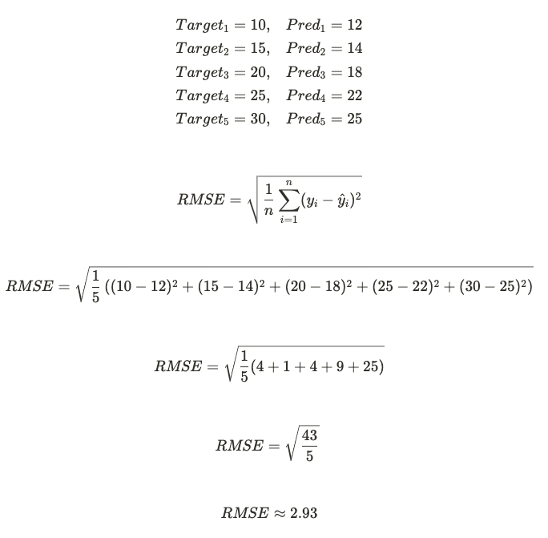
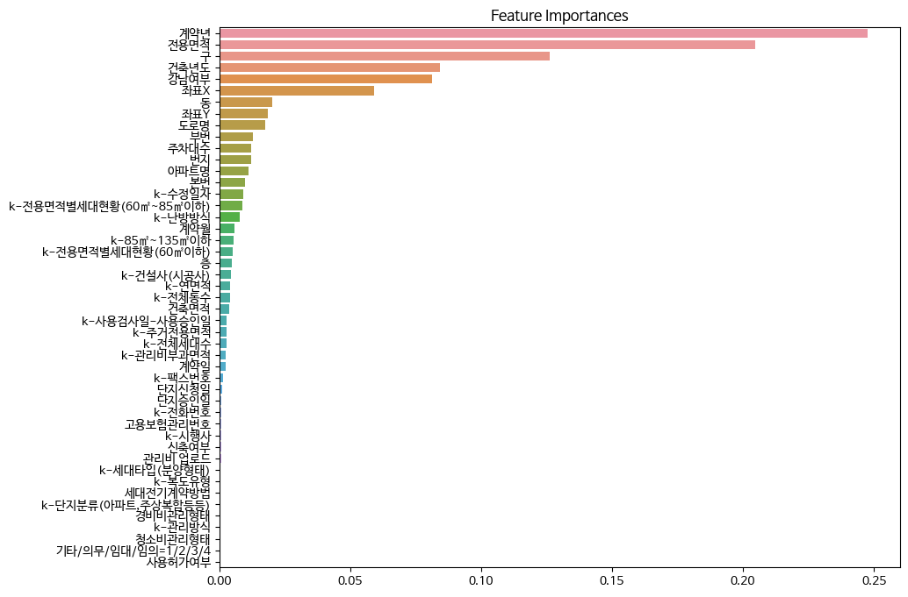
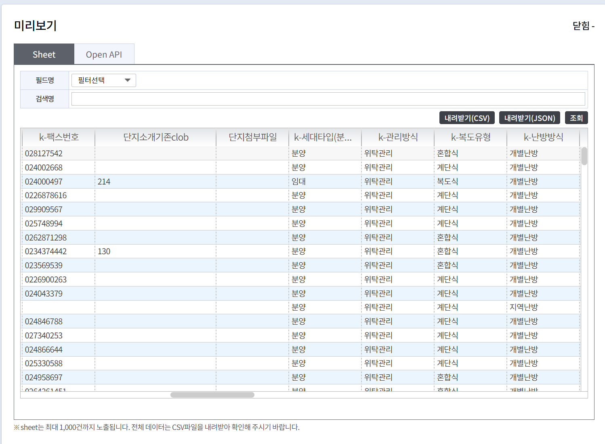
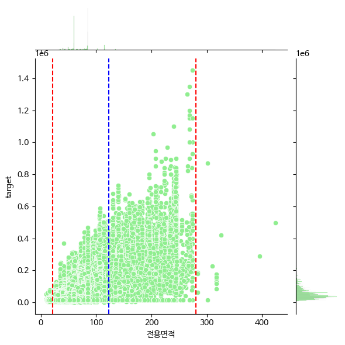
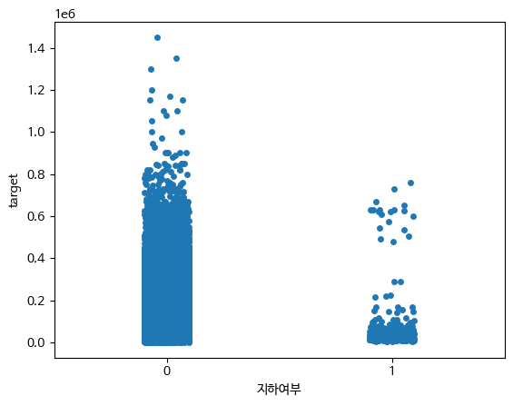
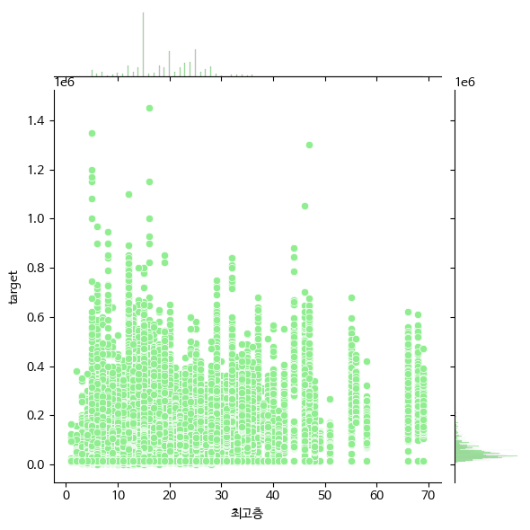
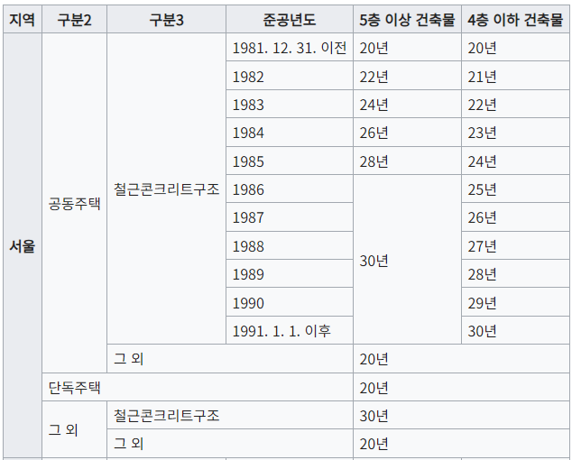
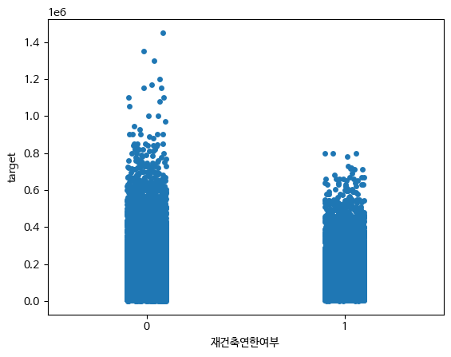
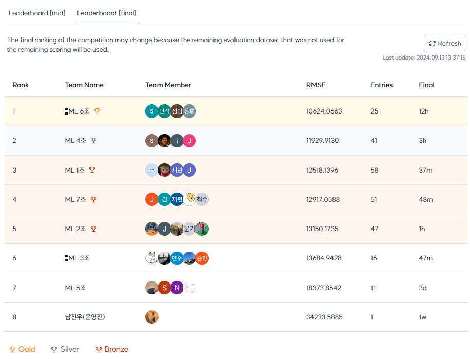

# Upstage AI Lab 아파트 실거래가 예측 대회 5조
## Team

|            마서연             |            권희수             |            김정우             |            김윤환             |            주남정             |
| :--------------------------------------------------------------: | :--------------------------------------------------------------: | :--------------------------------------------------------------: | :--------------------------------------------------------------: | :--------------------------------------------------------------: |
|                            팀장, 담당 역할                             |                            담당 역할                             |                            담당 역할                             |                            담당 역할                             |                            담당 역할                             |

## 0. Overview
### Environment
- aistages(https://stages.ai/competitions/331/server/list)에서 제공하는 GPU 서버

### Requirements
- matplotlib==3.7.1
- numpy==1.23.5
- pandas==1.5.3
- scipy==1.11.3
- seaborn==0.12.2
- scikit-learn==1.2.2
- statsmodels==0.14.0
- tqdm==4.66.1


## 1. Competiton Info

### Overview

- 해당 대회는 제공된 data와 baseline_code를 바탕으로 서울의 아파트의 해당 시점의 매매 실거래가를 예측하는 Regression 대회로, 평가지표로는 RMSE(Root Mean Squared Error)를 사용합니다.
- RMSE는 예측된 값과 실제 값 간의 평균편차를 측정합니다. 아파트 매매의 맥락에서는 회귀 모델이 실제 거래 가격의 차이를 얼마나 잘 잡아내는지 측정합니다.
<div align="center">
  
</div>

### Timeline

- 2024년 9월 9일(월) - 2024년 9월 13일(금) 13시

## 2. Components

### Directory

```
├── code
│   ├── baseline_code.ipynb
│   └── submit_code.ipynb
├── data
│   ├── train_add_2_columes.zip
│   └── train_with_heating.zip
└── img
|   └── *.png
└── README.md
└── readme_csv.md
```


## 3. Data descrption

### Dataset overview1

- 아파트 실거래가 예측 : 서울시 아파트 실거래가 매매 데이터를 기반으로 아파트 가격을 예측하기 위한 dataset 입니다. 
- 멘토님의 답변이나 강의 및 특강을 들으면서 얻었던 인사이트는 ML에서 좋은 성과를 내려면 EDA라는 기초공사를 얼마만큼 잘 해내야인 것 같았습니다.
- 주어진 train dataset인 train.csv에서 많은 항목의 결측치를 확인했는데 이러한 결측치 중 실거래가에 영향을 미치는 데이터를 보완할 수 있다면, 아파트 실거래가 예측같은 해당 시점의 매매 실거래가를 예측하는 Regression 대회의 평가지표(RMSE)를 올릴 수 있다고 판단했습니다. 
- 기존 아파트 가격과 관련된 연구되었던 자료를 리서치했고 그 중에 ‘난방방식’이 아파트 가격에 영향을 미친다는 자료를 확인했습니다. train.csv의 ‘k_난방방식’ 항목의 결측치가 상당부분 존재했으며, 이 데이터의 많은 부분은 서울시 공공주택 아파트 정보 Open API 등으로 데이터가 제공되어 있어 해당 데이터를 가져와 train.csv를 보완하면 된다고 판단했습니다.

### Dataset overview2

- 아파트 가격에 대한 도메인 지식이 많지 않아서 논문이나 기사 등을 참고해 가설을 세우고, EDA를 통해 검증하며 대회에서 유의미한 결과를 만들어가는 것을 목표로 설정했습니다.
- baseline 코드에서 도출된 Feature Importances와 자료를 통해 아래와 같이 가설을 세우고 관련 데이터를 가공하여 EDA를 진행하였습니다.
<div align="center">
  
</div>

### EDA & Data Processing

1-1. Database에 train.csv를 import
- Tools: MariaDB 11.5.2, Mysql Workbench 8.0 CE

1-2. DB에 적재된 train 데이터 중 k_난방방식 항목을 외부 데이터를 가져와 보완

&emsp;1) 데이터 import를 편하게 하기 위해서 일부러 컬럼의 데이터 형태를 VARCHAR(255) 생성  
```
CREATE TABLE ml.train (
    시군구 VARCHAR(255),
    번지 VARCHAR(255),
    본번 VARCHAR(255),
    부번 VARCHAR(255),
    아파트명 VARCHAR(255),
    전용면적 VARCHAR(255),
    계약년월 VARCHAR(255),
    계약일 VARCHAR(255),
    층 VARCHAR(255),
    건축년도 VARCHAR(255),
    도로명 VARCHAR(255),
    해제사유발생일 VARCHAR(255),
    등기신청일자 VARCHAR(255),
    거래유형 VARCHAR(255),
    중개사소재지 VARCHAR(255),
    k_단지분류 VARCHAR(255),
    k_전화번호 VARCHAR(255),
    k_팩스번호 VARCHAR(255),
    단지소개기존clob TEXT,
    k_세대타입 VARCHAR(255),
    k_관리방식 VARCHAR(255),
    k_복도유형 VARCHAR(255),
    k_난방방식 VARCHAR(255),
    k_전체동수 VARCHAR(255),
    k_전체세대수 VARCHAR(255),
    k_건설사 VARCHAR(255),
    k_시행사 VARCHAR(255),
    k_사용검사일_사용승인일 VARCHAR(255),
    k_연면적 VARCHAR(255),
    k_주거전용면적 VARCHAR(255),
    k_관리비부과면적 VARCHAR(255),
    k_전용면적별세대현황_60㎡이하 VARCHAR(255),
    k_전용면적별세대현황_60㎡~85㎡이하 VARCHAR(255),
    k_85㎡~135㎡이하 VARCHAR(255),
    k_135㎡초과 VARCHAR(255),
    k_홈페이지 VARCHAR(255),
    k_등록일자 VARCHAR(255),
    k_수정일자 VARCHAR(255),
    고용보험관리번호 VARCHAR(255),
    경비비관리형태 VARCHAR(255),
    세대전기계약방법 VARCHAR(255),
    청소비관리형태 VARCHAR(255),
    건축면적 VARCHAR(255),
    주차대수 VARCHAR(255),
    기타_의무_임대_임의 VARCHAR(255),
    단지승인일 VARCHAR(255),
    사용허가여부 VARCHAR(255),
    관리비_업로드 VARCHAR(255),
    좌표X VARCHAR(255),
    좌표Y VARCHAR(255),
    단지신청일 VARCHAR(255),
    target VARCHAR(255)
);
```
&emsp;2) MySql Workbench는 import할 때 csv의 첫번째 행에 한글이 들어있으면 무조건 cp949 에러를 뱉어내므로 csv 파일을 첫번째 라인을 삭제
```
시군구,번지,본번,부번,아파트명,전용면적(㎡),계약년월,계약일,층,건축년도,도로명,해제사유발생일,등기신청일자,거래유형,중개사소재지,"k-단지분류(아파트,주상복합등등)",k-전화번호,k-팩스번호,단지소개기존clob,k-세대타입(분양형태),k-관리방식,k-복도유형,k-난방방식,k-전체동수,k-전체세대수,k-건설사(시공사),k-시행사,k-사용검사일-사용승인일,k-연면적,k-주거전용면적,k-관리비부과면적,k-전용면적별세대현황(60㎡이하),k-전용면적별세대현황(60㎡~85㎡이하),k-85㎡~135㎡이하,k-135㎡초과,k-홈페이지,k-등록일자,k-수정일자,고용보험관리번호,경비비관리형태,세대전기계약방법,청소비관리형태,건축면적,주차대수,기타/의무/임대/임의=1/2/3/4,단지승인일,사용허가여부,관리비 업로드,좌표X,좌표Y,단지신청일,target
```
&emsp;3) train.csv를 DB로 import
```
LOAD DATA LOCAL INFILE "D:/dataset/train.csv"
INTO TABLE ml.train
FIELDS TERMINATED BY ","   # csv 구분자 입력
optionally enclosed by '"' #쉼포가 포함된 데이터를 따옴표로 묶어 하나의 컬럼으로 처리
LINES TERMINATED BY "\n" #라인 띄어쓰기
IGNORE 1 ROWS; # 첫 행이 컬럼명인 경우, 해당 행 저장 X
```
&emsp;4) k_난방데이터를 서울시 공동주택 아파트 정보에서 추출

&emsp;&emsp;- 서울시 공동주택 아파트 정보의 Open API (https://data.seoul.go.kr/dataList/OA-15818/S/1/datasetView.do)
<div align="center">
  
</div>

&emsp;5) 서울시 공동주택 아파트 정보에서 주소를 기반으로 ‘k_난방방식’과 연된된 항목인 ‘k_단지분류’를 업데이트 
```
update train set k_난방방식 = '개별난방' , k_단지분류 = '아파트' where 도로명 = '서달로 83';
update train set k_난방방식 = '개별난방' , k_단지분류 = '아파트' where 도로명 = '송파대로8길 10';
```

1-3. 보완한 train 데이터를 csv 형태로 export
```
SELECT INTO OUTFILE 'd:\\dataset\\train_with_heating.csv'
FIELDS
TERMINATED BY ','
OPTIONALLY ENCLOSED BY '"'
FROM ml.train;
```

1-4. 팀 공유

&emsp;1) git에 올릴 경우 데이터 용량 이슈로 인해 csv 파일 형태가 아니라 압축하여 올려야 함

&emsp;2) 공유된 파일

&emsp;&emsp;- train_with_heating.zip: k_난방방식만 보완한 데이터
<div align="center">
  
</div>
<br></br>
&emsp;&emsp;- train_with_heating.csv의 헤더

```
시군구,번지,본번,부번,아파트명,전용면적(㎡),계약년월,계약일,층,건축년도,도로명,해제사유발생일,등기신청일자,거래유형,중개사소재지,"k-단지분류(아파트,주상복합등등)",k-전화번호,k-팩스번호,단지소개기존clob,k-세대타입(분양형태),k-관리방식,k-복도유형,k-난방방식,k-전체동수,k-전체세대수,k-건설사(시공사),k-시행사,k-사용검사일-사용승인일,k-연면적,k-주거전용면적,k-관리비부과면적,k-전용면적별세대현황(60㎡이하),k-전용면적별세대현황(60㎡~85㎡이하),k-85㎡~135㎡이하,k-135㎡초과,k-홈페이지,k-등록일자,k-수정일자,고용보험관리번호,경비비관리형태,세대전기계약방법,청소비관리형태,건축면적,주차대수,기타/의무/임대/임의=1/2/3/4,단지승인일,사용허가여부,관리비 업로드,좌표X,좌표Y,단지신청일,target
```

&emsp;&emsp;- train_add_2_columns.zip: k_난방방식과 더불어 k_단지분류의 결측치에 아파트를 업데이트, 금리와 1인당 총국민소득 2개 항목을 추가함
<br></br>
&emsp;&emsp;- train_add_2_columns.csv의 헤더

```
시군구,번지,본번,부번,아파트명,전용면적(㎡),계약년월,계약일,층,건축년도,도로명,해제사유발생일,등기신청일자,거래유형,중개사소재지,"k-단지분류(아파트,주상복합등등)",k-전화번호,k-팩스번호,단지소개기존clob,k-세대타입(분양형태),k-관리방식,k-복도유형,k-난방방식,k-전체동수,k-전체세대수,k-건설사(시공사),k-시행사,k-사용검사일-사용승인일,k-연면적,k-주거전용면적,k-관리비부과면적,k-전용면적별세대현황(60㎡이하),k-전용면적별세대현황(60㎡~85㎡이하),k-85㎡~135㎡이하,k-135㎡초과,k-홈페이지,k-등록일자,k-수정일자,고용보험관리번호,경비비관리형태,세대전기계약방법,청소비관리형태,건축면적,주차대수,기타/의무/임대/임의=1/2/3/4,단지승인일,사용허가여부,관리비 업로드,좌표X,좌표Y,단지신청일,target,금리,1인당_총국민소득
```

1-5. 보완된 데이터 

**총 1,118,821건의 데이터** 중에 **874,743건의 데이터가 교체**되었으며 데이터 프레임은 원본 유지되었으며 **k_난방방식**에 들어가는 데이터는 **개별난방, 지역난방, 중앙난방, 기타, NaN**으로 총 5개로 분류됨

1-6. 난방방식의 Feature Importances
<div align="center">
  
</div>
<br></br>
2-1. 직접적으로 실거래가에 IQR를 사용해 이상치를 제거하면 유의미한 변화가 있을 것으로 추측

- 실거래가를 의미하는 target의 이상치를 제거한 뒤 RMSE 점수가 너무 높아져서 해당 feature drop

2-2. baseline 코드에서 122.92 이상의 전용면적을 이상치로 제거하고 있으나, 이 때문에 상당수 유의미한 데이터가 유실되고 있을 것으로 추측  
- 전용면적 이상치 상한을 122.92(blue)에서 280(red)으로 수정 후, RMSE 점수가 절반으로 감소
<div align="center">
  
</div>

2-3. 지하층(1층 미만)의 데이터도 존재하여 분석해보았더니, 예상대로 대부분의 지하층은 낮은 가격대를 형성하고 있어 관련 파생변수가 유의미할 것으로 추측  
- 지하층인 데이터 자체가 전체 중 극히 일부(지하 : 262개)라 큰 영향도는 없었으나 RMSE 점수가 소폭 감소
<div align="center">
  
</div>

2-4. 기사를 통해 고층 아파트의 평균 가격대가 높다는 점을 파악하여 아파트별 최고층이 영향도가 클 것으로 추측  
- 최고층 파생변수를 추가하였으나, 데이터 상으로 큰 의미를 찾을 수 없었기에 해당 feature drop
<div align="center">
  
</div>

2-5. 재건축 조건을 만족한 아파트의 가격대가 높아지는 경향이 있어 해당 조건을 만족하는지 여부를 찾으면 영향도가 클 것으로 추측  
- 재건축 조건에 연한 이외에도 안전진단점수가 D등급 혹은 E등급을 받아야하는데 관련 데이터를 구하고 join할 시간이 부족하였음. 재건축연한만을 충족하는 경우, 오래된 아파트여서 가격이 오히려 더 낮은 것을 지표로 확인할 수 있었기에 feature drop
<div align="center">
  
</div>
<div align="center">
  
</div>

## 4. Result

### Leader Board
<div align="center">
  
</div>
- 저희 팀은 "ML 5조" 였습니다.

### Presentation
https://github.com/Upstage-AI-Lab-4/upstage-ai-ml-regression-ml-5/blob/main/%5B%ED%8C%A8%EC%8A%A4%ED%8A%B8%EC%BA%A0%ED%8D%BC%EC%8A%A4%5D%20Upstage%20AI%20Lab%204%EA%B8%B0_ML%20%EA%B2%BD%EC%A7%84%EB%8C%80%ED%9A%8C_%EB%B0%9C%ED%91%9C%EC%9E%90%EB%A3%8C_5%EC%A1%B0.pdf
